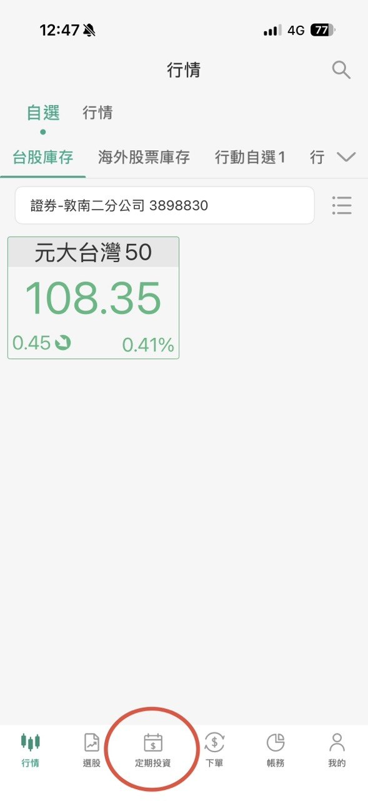
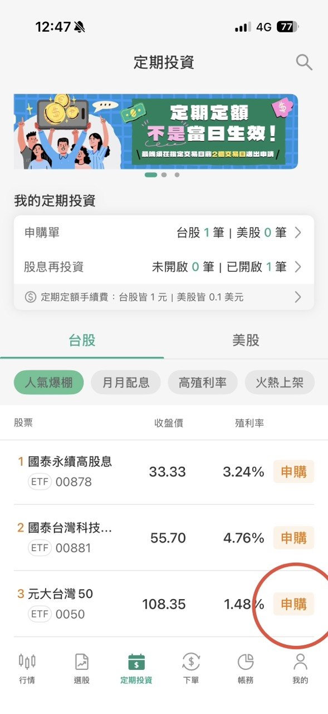
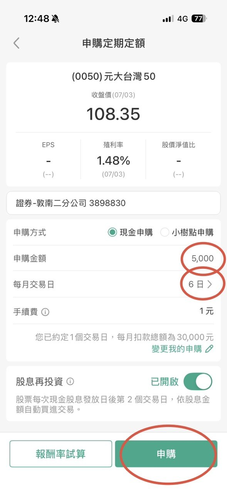
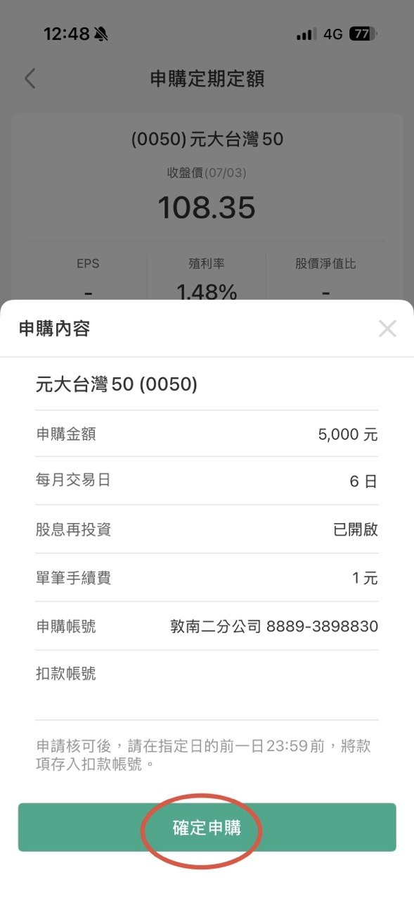
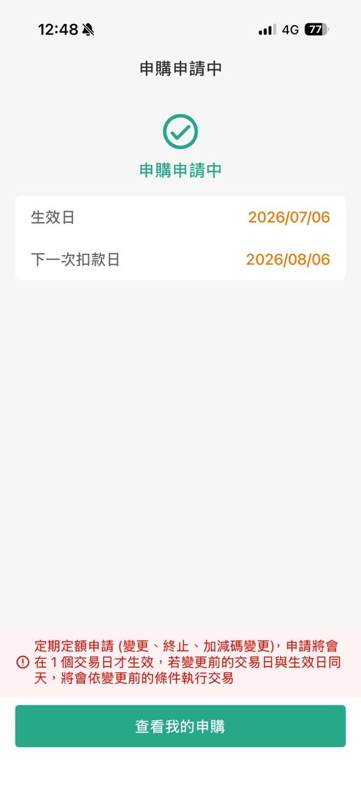

# 給 ETF 投資新手的全面教學手冊：從商業本質到實戰資產配置

## 第零章：30秒快速上手懶人包

* **什麼是 ETF？** 它就像一盤「綜合水果盤」，你只要花少少的錢買一口，就等於同時吃到了全市場最賺錢、最頂尖的幾十家大公司股票，不用自己挑到眼花。
* **該選定存還是 ETF？** 定存是「保本防禦」的工具，確保資產絕對安全、提供穩定現金流；大盤型 ETF 則是「資產進攻」的工具，讓資金跟著一流企業成長來對抗通膨。兩者並非對立，而是需要依據個人需求進行互相搭配。
* **新手該買哪一檔？** 不用瞎猜！台股常見的選擇是追蹤全台前50大企業的 **0050（元大台灣50）**；美股則是追蹤美國500強頂尖企業的 **VOO（Vanguard標普500 ETF）**。
* **怎麼買？** 極其簡單。開立好證券戶並綁定您的銀行交割帳戶，直接設定「每月定期定額」自動扣款買進，接著專注於本業與安心生活。

---

## 第一章：股票的前世今生 — 400 年來的財富革命

在開始買賣之前，我們必須先知道「股票」是怎麼來的。股票的誕生是人類金融史上最偉大的創新之一，它成功將「個人的冒險資本」轉化為「集體的社會財富」。

### 1. 股票的起源：大航海時代與海上冒險（15-17世紀）
在 16 世紀末，歐洲掀起了前往亞洲尋找香料（胡椒、肉桂）的狂熱。當時一艘商船只要能平安返航，帶回的香料就能獲得數倍暴利。
* **痛點：** 海上航行面臨風暴、海盜等極高風險，「船沉了，商人就破產了」。且建造大船需龐大資金，單一商人難以負擔。
* **世界第一家股份公司（1602年）：** 荷蘭人創立了「荷蘭東印度公司」（VOC），向全荷蘭國民募集資金，發行紙質的「股份憑證」。這開創了「有限責任」與「利益共享」機制 —— 船沉了，投資人最多損失買股票的錢；成功返航，則依持股比例分紅。
* **世界第一家證券交易所（1611年）：** 股票發行後，投資人有變現需求。荷蘭阿姆斯特丹成立了世界第一家證券交易所，股票開始有了「市場價格」並允許自由轉讓。

### 2. 投機泡沫與法規誕生（18-19世紀）
* **南海與密西西比泡沫（1720年）：** 英國與法國的公司利用貿易壟斷權瘋狂吹捧獲利前景，引發投機狂熱。連科學家牛頓也參與其中並留下名言：「我能計算天體的運行，卻無法計算人類的瘋狂。」隨後英國通過《泡沫法案》嚴格限制公司成立，股市沉寂百年。
* **工業革命與華爾街崛起：** 1792 年，24 名經紀人在紐約華爾街簽署「梧桐樹協議」，成為紐約證券交易所（NYSE）前身。19 世紀造鐵路、採礦的龐大資金需求，讓華爾街正式成為全球金融中心。

### 3. 現代股市建立與全民大航海時代（20世紀至今）
* **1929年大蕭條與監管：** 股市過度槓桿引發大崩盤後，美國在 1934 年成立證券交易委員會（SEC），實施嚴格的資訊揭露制度，奠定「公平、公正、公開」基石。
* **電子化與指數化：** 1971 年納斯達克（NASDAQ）成立；1976 年先鋒集團（Vanguard）創辦人約翰·柏格推出世界第一檔追蹤 S&P 500 的指數基金，提倡「買下整個市場」，改變了長線投資觀念。

> 股票的本質從未改變 —— 它是企業家募集資金的工具，也是一般人共享社會經濟進步成果的橋樑。只要人類科技與文明在進步，代表頂尖企業集合的大盤，長線趨勢就會持續上升。

---

## 第二章：商業的本質與現金流動 — 買股票到底是在買什麼？

你可以把買股票想像成「跟朋友合資開雞排店」。你出資 10 萬元，朋友給你一張收據，寫著你擁有這家店 10% 的股份。月底結帳淨賺 5 萬元，朋友依據 10% 股份分給你 5,000 元。這就是股票最迷人的地方：你不需要懂怎麼做生意，只要購買股票成為微型股東，全球頂尖菁英就會幫你賺錢。

很多新手常混淆幾個觀念，我們一次釐清：

### 1. 觀念澄清：你買股票的錢，真的是給公司嗎？
* **初次上市（IPO）或增資：** 只有在這時候，投資人掏出的現金才會直接流進企業的銀行帳戶，企業因此獲得發展資金。
* **一般股市交易（次級市場）：** 你現在天天在 App 上買的 Apple (AAPL) 或台積電 (2330) 股票，其實是「其他投資人」手上持有的舊股票。你買股票的錢是流進「賣方」口袋，企業這時一毛錢也拿不到。

### 2. 觀念澄清：利息 vs. 股利
* **利息（Interest）：** 你把錢借給銀行或買債券，不論企業今年賺不賺錢，都必須固定支付給你的代價。
* **股利（Dividend）：** 你身為「公司股東」，公司今年大賺錢後分享給你的紅利（配息/配股）。如果虧錢，公司可以決定不發股利。

### 3. 實戰解析：iPhone 推出時，現金與股票如何流動？
當 Apple 宣布推出新款 iPhone 時，不僅是消費者買手機，更是一場龐大的跨國金錢流動：

| 參與角色 | 動作 | 現金流向 | 股票/資產變動 |
| :--- | :--- | :--- | :--- |
| **消費者** | 購買新手機 | 💸 流向 Apple 與台灣供應鏈 | ❌ 無股票變動 |
| **投資人/機構** | 看好新機前景 | 💸 流向證券市場（買方） | 📈 資金推升市場整體估值 |
| **Apple 企業** | 賺取手機利潤 | 💸 支付供應鏈、發股利、買庫藏股 | 📉 市面流通股數減少（股票內在價值變高） |
| **長線投資人/ETF**| 持續長期持有 | 💰 獲得股利分配或資產淨值增長 | 🔄 與企業共享長期的獲利與成長成果 |

> **邏輯修正提醒：** 股價反映的是企業長期的價值成長。長線投資人（包含大盤型 ETF 持有者）並非在玩「低買高賣、尋找接盤俠」的零和遊戲，而是透過持續持有，與全球頂尖企業共享長期營運所帶來的利潤與資產增值。

---

## 第三章：從定存到投資 — 理性的資產配置與風險認知

在理財的世界裡，沒有最完美的工具，只有最適合當下情境的配置。定存與 ETF 各司其職，盲目地將資金全數投入任何一方都是不理智的。

### 1. 銀行定存 vs. 大盤型 ETF 客觀比較

| 比較項目 | 銀行定存 | 大盤型 ETF (如 0050, VOO) |
| :--- | :--- | :--- |
| **主要功能** | 資產保本、防禦風險、隨時動用 | 資產增值、對抗通膨、參與經濟成長 |
| **預期報酬** | 固定利息（約 1% ~ 2% 波動極小） | 浮動報酬（長期年化歷史平均約 7% ~ 10%）|
| **最大風險** | 購買力被通膨侵蝕（慢性資產縮水） | 短期市場波動劇烈，可能面臨帳面虧損 |
| **變現速度** | 極快（隨時解約即可現領） | 快（股市交易賣出後需等兩個交易日撥款）|
| **心理壓力** | 極低（看得到資產本金不變） | 中至高（需忍受市場上下起伏的帳面變動）|

### 2. 哪些情況下，你「必須」優先考慮定存？
這篇教學並非 ETF 的瘋狂信徒推廣文，我們必須客觀承認定存的不可替代性。以下三種情況，你應優先選擇定存：
1.  **緊急預備金：** 建議至少準備 3 到 6 個月的生活費放在定存。當遇到失業、意外生病或急需現金時，這筆錢能隨時動用，你不需要迫使自己在股市大跌時忍痛割肉賣股票。
2.  **短期即將動用的資金：** 如果您預計在 1 到 3 年內要支付買房頭期款、結婚基金、買車或子女學費，這筆資金「絕對不能承受任何短期虧損風險」，務必放在定存。
3.  **無法承受帳面虧損的保守心態：** 投資因人而異。如果股市下跌 10% 會讓您焦慮到無法入睡、嚴重影響生活品質，那麼定存提供的安定感對您而言就是無價的。

### 3. ETF 的市場波動風險提示
必須特別提醒新手：**雖然大盤型 ETF 長期回報優異，但短期內（如一到兩年內）仍有下跌 20% 甚至 30% 以上的風險。**（例如：2008 年金融海嘯、2022 年全球央行激烈升息年）。因此，投入 ETF 的資金必須是「短期內用不到的閒錢」，並做好長期抗戰的心理準備。

- [Smart智富ETF研究室](https://smart.businessweekly.com.tw/Reading/IndepArticle.aspx?id=6007940)
- [金管會提醒ETF並非穩賺不賠商品，投資前應先瞭解商品特性及注意風險](https://www.fsc.gov.tw/ch/home.jsp?id=96&parentpath=0,2&mcustomize=news_view.jsp&dataserno=202403270001&dtable=News)

---

### 4. 深入底層：ETF 發行商的 3 大獲利模式
很多人會問：「既然大盤長期看漲，為什麼發行商（如 Vanguard、元大）不把錢全拿去自己投資，而是要開一檔 ETF 幫別人管理？」因為他們是「開賭場的服務提供者」，不是「賭客」，他們的獲利模式追求的是規模經濟與旱澇保收：

1.  **內扣管理費：** 這是發行商最主要的收入。這筆費用是從 ETF 淨值中每天微幅扣除（例如 VOO 每年扣 0.03%）。當大盤大漲，資產規模變大，收到的管理費會暴增；即便大盤大跌，發行商依然照常按比例收費，絕不會虧損。
2.  **證券借貸收入：** 發行商手裡持有大量的企業現股，他們可以依法將這些股票借給市場上的做空機構，並從中收取借券利息，增加額外營收。
3.  **換股交易回饋：** 當 ETF 定期調整成分股時，由於資金規模極其龐大，與合作券商之間會產生手續費折讓或分潤。

> **為什麼不把自有資金全部拿去賭股市？** 
> * **開賭場比當賭客穩健：** 自有資金投資大盤若遇股災會面臨虧損；而當發行商，股災時僅是管理費少收，公司依然穩健營運。
> * **需要穩定的營運現金流：** 發行商需支付經理人薪資、全球合規律師費、IT 系統維護。若資金全套在股市，遇到金融海嘯可能引發流動性危機。
> * **法規的嚴格限制：** 全球金融監管機構（如台灣金管會、美國 SEC）對金融機構的自有資金投資上限有極嚴格的限制，強制要求其持有大量低風險資產（如美國國債），絕不允許全倉押注股市。

---

## 第四章：主流 ETF 大解密

新手不要總想著一夕暴富炒短線，老老實實買進參與整體經濟成長的「大盤指數標的」，才是勝率最高的策略。

| ETF 代號與名稱 | 追蹤什麼市場 | 優點 | 缺點與風險 | 適合什麼樣的新手 |
| :--- | :--- | :--- | :--- | :--- |
| **元大台灣50 (0050)** | 台灣股市市值前 50 大的頂尖企業。 | 一網打盡台灣最賺錢的護國神山群。簡單透明，完全與台灣經濟成長綁定。 | 台積電單一公司權重過高（常超過50%），受單一企業股價波動影響極大。 | 偏好在地投資、看好台灣半導體與科技高成長，且不想處理換匯的新手。 |
| **Vanguard 標普500 (VOO)** | 美國股市前 500 大頂尖大型企業。 | 網羅全球最強的 500 家巨頭，行業分散極度均勻，歷史長線走勢極為穩健。 | 需透過複委託或海外券商購買，存在匯率波動風險。 | 追求最穩健、最長線資產增值，希望將資產佈局在全球第一大經濟體的人。 |
| **Invesco 納斯達克100 (QQQ)** | 美國納斯達克上市的前 100 大非金融企業。 | 爆發力極強！集中全球最頂尖科技與 AI 龍頭，長線歷史回報率驚人。 | 產業高度集中於科技業，科技股波動劇烈，估值修正時（如空頭市場）跌幅顯著大於 VOO。 | 能承受較大心理帳面波動、極度看好全球科技與 AI 劇烈發展的新手。 |

---

## 第五章：實戰演練 — 邁出投資的第一步

懂了理論，不踏出第一步就永遠只是看熱鬧。以下我們將實戰演練分為「通用定期定額步驟」與「國泰證券 App 實戰（以 0050 為例）」兩部分，幫助你快速開始。

### 1. 通用定期定額步驟（各券商適用）

如果你使用的是國泰以外的券商（如富邦、元大、凱基等），通用的定期定額步驟如下：

1. **開戶與綁定：** 選擇一家信譽良好的大型證券商，準備好雙證件（身分證與健保卡/駕照）在線上 APP 即可完成證券戶開立，並綁定好銀行帳戶作為未來的扣款交割戶。
2. **資金準備（入金）：** 在設定的扣款日之前，將你每個月預計投資的閒錢（例如：3,000 元或 5,000 元，務必是短期內用不到的錢）轉帳存入你的銀行交割帳戶中。
3. **尋找定期定額功能專區：** 打開證券商 APP，點選功能選單中的「台股」或「美股」標籤，接著在畫面中找到「定期定額」或「自動投資」的功能入口。
4. **搜尋你想買的 ETF 標的：** 在搜尋欄位直接輸入你想購買的代號（例如：台股輸入 `0050`，美股輸入 `VOO`），點選該標的進入申購畫面。
5. **設定扣款金額與日期：** 輸入你每個月打算投資的金額（目前許多券商台股定期定額最低只要 100 元），並勾選每個月要自動扣款的日期（例如每月的 8 號、18 號或 28 號，可複選以分散天數）。
6. **確認並送出申購：** 仔細檢查扣款金額、日期與 ETF 代號無誤後，按下「確認申購」，並輸入交易密碼。恭喜你，你的專屬自動財富增值計劃正式啟動了！
7. **(美股專屬) 選擇扣款幣別：** 若申購美股 ETF，系統會讓你選擇「台幣」或「外幣」扣款。想追求極致省力，可選「台幣扣款」，交由券商自動依當下匯率換匯；若想精打細算，則可選「外幣扣款」，平時趁匯率低點自行換好美元存入外幣交割帳戶中。

---

### 2. 國泰證券 App 實戰（以 0050 為例）

[國泰證券官方網站](https://www.cathaysec.com.tw)

國泰證券是目前台灣定期定額非常熱門的選擇，其台股定期定額買進手續費享有均一價 **1 元** 的優惠（優惠已確認延長至 2026 年 12 月 31 日）。以下為在 **「國泰證券 App」** 進行定期定額的詳細圖文步驟，引用自國泰 App 實戰操作畫面：

#### 步驟 1：進入定期投資專區
打開並登入 **「國泰證券 App」**，在首頁快捷功能或下方選單中，點選 **「定期投資」** 圖示進入存股專區。

#### 步驟 2：搜尋並點選申購標的
在定期投資專區內，點選「申購設定」，選台股 0050。

可切換「台股」或「美股」頁籤，在上方搜尋框輸入您想買的 ETF 代號（如台股 `0050` 或美股 `VOO`），接著點選該標的進入設定。

#### 步驟 3：設定扣款金額與日期
輸入每期打算投資的金額（台股定期定額每筆最低 **100 元** 起，以百元為單位累加；美股定期定額最低 **10 美元** 起）。並利用「每月交易日」功能，勾選每月 1 號到 31 號之中的任一天或數天作為扣款日。

#### 步驟 4：確認申購內容
仔細確認您的 ETF 代號、約定扣款日、金額與手續費（台股買進定期定額手續費為 1 元）無誤後，輸入您的交易密碼，按下 **「確認申購」** 即送出申請。

#### 步驟 5：申請中畫面
等後續申請成功後，務必於扣款日前一天 23:59 前，將足夠的扣款金額存入國泰世華交割帳戶中。

---

> **最後的叮嚀：** 投資市場上最終的贏家，往往不是最聰明、最會預測高低點的人，而是最能堅持紀律、在波動中依然不中斷扣款的人。定期定額、長線持有，讓時間與複利成為你最好的朋友。

---

## 延伸閱讀與客觀觀點推薦
### 1. 臺灣證券交易所 - 宅在家學習網
* **觀點特性**：官方設立的純教學網站，不具商業推銷色彩。
* **推薦理由**：內含最正確的台股交易規則、ETF 運作機制與風險控管觀念，是新手建立基礎防禦與法規意識的最佳官方指南。
* **網址**： https://shl.twse.com.tw/

---

### 2. Mr. Market 市場先生 - ETF 是什麼？怎麼買？ETF 新手入門教學
* **觀點特性**：台灣極具代表性的系統化理財部落格。
* **推薦理由**：詳細拆解 ETF 的底層架構、費用計算與選擇指標，資訊量龐大且圖文並茂，適合完全沒有概念的新手建立完整框架。
* **網址**： https://rich01.com/etf0050/

---

### 3. 綠角財經筆記 - 指數化投資的本質與長線心法
* **觀點特性**：台灣指數化投資的先驅與資深導師。
* **推薦理由**：深刻闡述為何一般大眾不應盲目追求選股與擇時，而是應透過「買下整個市場」的低成本資產配置策略，安全穩定地累積長線財富。
* **網址**： https://greenhornfinancefootnote.blogspot.com/2026/03/50etf00502026.html

---

### 4. 股癌 Gooaye - 官方網站與 Podcast 節目
* **觀點特性**：台灣具高市場敏感度的財經節目。
* **推薦理由**：雖然內容涉及個股實戰，但核心觀點常提醒新手應以大盤型 ETF 作為資產配置核心，並重視實戰中的心理素質調適。
* **網址**： https://gooaye.com

